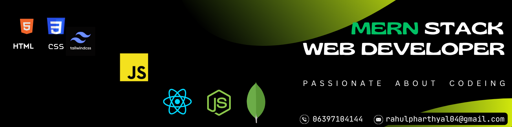

<h1 align="center">Hi 👋, I'm Rahul Pharthyal</h1>
<h3 align="center">A Web Developer from India</h3>

  

<!-- 
  
 -->

- 🔭 I’m currently working on **AI Chat-Bot**

- 🌱 I’m currently learning **Python, TypeScript**

- 👯 I’m looking to collaborate on **Open Source**

- 👨‍💻 All of my projects are available at [rahulsinghpharthyal](https://rahulsighpharthyal.vercel.app/)

- 💬 Ask me about **Frontend Backend**

- 📫 How to reach me **rahulpharthyal04@gmail.com**

- 📄 Know about my experiences [https://drive.google.com/file/d/1ApYUykCxeIeKvGpNXmI2SMpvcvp9CkuE/view?usp=drive_link](https://drive.google.com/file/d/1ApYUykCxeIeKvGpNXmI2SMpvcvp9CkuE/view?usp=drive_link)

<h3 align="left">Connect with me:</h3>

<h3 align="left">Languages and Tools:</h3>

                         

<!-- 

 -->

<!-- 
&nbsp;
 -->

